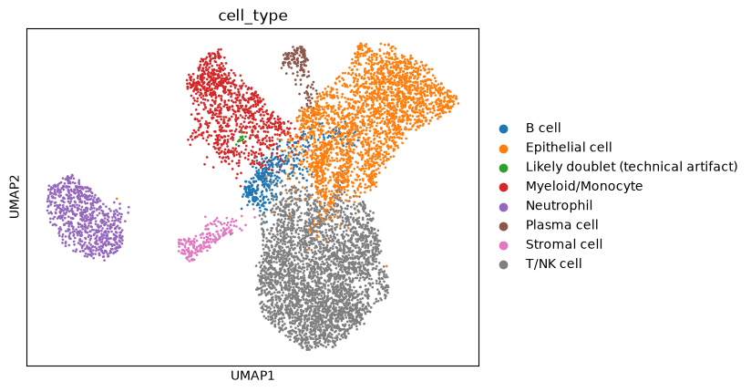

# Single-Cell RNA-Seq Analysis: Endometrial Cancer (GSE203612)

[](https://github.com/MaryOlufunmilola/scRNA-seq-analysis/actions/workflows/ci.yml)

An end-to-end, tested single-cell RNA-seq pipeline on three public human
**uterine corpus endometrial carcinoma (UCEC)** tumors
([GSE203612](https://www.ncbi.nlm.nih.gov/geo/query/acc.cgi?acc=GSE203612),
Barkley et al., *Nature Genetics* 2022): QC and doublet detection,
multi-patient integration, clustering, tumor-compartment annotation,
cross-patient label transfer with a neural network, and exploratory
signature-matrix export and cell-cell communication.



> **Scope:** three patients, six libraries, 8,000 cells after QC. Enough to
> build and test the pipeline and map these tumors' cell populations, not to
> make general claims about endometrial cancer.

## Pipeline

| Step | Script | What it does |
|---|---|---|
| 1 | `preprocess.py` | Download and checksum-verify GEO data; QC (min 100 genes, max 15% mito); per-library Scrublet doublets; normalization; HVG selection |
| 2 | `clustering.py` | PCA, Harmony integration across patients, Leiden clustering, UMAP, subsampling stability (ARI), composition tables |
| 3 | `annotate.py` | Marker-panel annotation (epithelial, stromal, endothelial, immune), with CellTypist as an immune-only cross-check and a cluster-level doublet test |
| 4 | `machine_learning.py` | PyTorch classifier on train-only PCA; leave-one-patient-out evaluation; Integrated Gradients gene attributions |
| 5 | `export_signature_matrix.py` | Linear-scale cell-type reference for bulk deconvolution (e.g., TCGA-UCEC) |
| 6 | `cell_communication.py` | Exploratory ligand-receptor inference (liana-py, CellChat method) on all genes |

## Quick start

```bash
git clone https://github.com/MaryOlufunmilola/scRNA-seq-analysis.git
cd scRNA-seq-analysis
pip install -r requirements.txt          # or requirements-lock.txt to reproduce exactly

bash run_pipeline.sh                      # tests + steps 1-4, logs in logs/
bash run_pipeline.sh --all                # also steps 5-6
```

Then open `notebooks/analysis.ipynb` to explore the outputs.

## Key results

**Cell types:** T/NK cell (3,073), epithelial (2,514), myeloid/monocyte (960),
neutrophil (700), B cell (395), stromal (192), plasma cell (154), plus one
12-cell doublet cluster caught by the cluster-level test.

**Cross-patient label transfer** (train on two patients, predict the third):

| Held-out patient | Accuracy | Macro-F1 |
|---|---|---|
| NYU_UCEC1 | 0.90 | 0.79 |
| NYU_UCEC2 | 0.95 | 0.78 |
| NYU_UCEC3 | 0.97 | 0.94 |

The macro-F1 gap comes almost entirely from plasma cells, 93% of which are
from one patient; excluding them, macro-F1 is 0.91–0.94. This measures
label-transfer consistency within the dataset, not independent validation.

**Highlights**
- The classifier's top epithelial gene is **WFDC2 (HE4)**, a known
  endometrial cancer marker absent from the curated panel.
- CellTypist and the marker panel agree on 8 of 10 immune clusters; both
  disagreements were resolved by expression evidence (a doublet cluster and
  a neutrophil cluster).
- Clustering is moderately stable (mean ARI 0.74 over subsamples).

## Testing and reproducibility

- **84 unit tests** on synthetic data (pytest; Scrublet, CellTypist, and
  Harmony stubbed), covering data-leakage guards, Integrated Gradients
  properties, linear-scale signature averaging, and safe archive extraction.
  CI runs `pytest` and `ruff` on Python 3.10 and 3.11.
- Pinned SHA-256 checksums for the GEO archive and CellTypist model;
  parameters and package versions recorded with every run; exact versions in
  `requirements-lock.txt`.

```bash
pip install -r requirements-dev.txt
pytest                       # pytest -m "not slow" for a quick run
ruff check .
```

## Limitations

Three patients, with several populations concentrated in one; T vs. NK and
fibroblast vs. pericyte not separable at this depth (reported as "T/NK cell"
and "Stromal cell"); no ambient-RNA correction; malignant vs. normal
epithelium not distinguished; cell-cell communication p-values permute cells,
not patients.

## Data source

Barkley D, Moncada R, Pour M, et al. "Cancer cell states recur across tumor
types and form specific interactions with the tumor microenvironment."
*Nature Genetics* 2022. Samples: GSM6177620–GSM6177622 (NYU_UCEC1–3).

## License

MIT -- see `LICENSE`.
